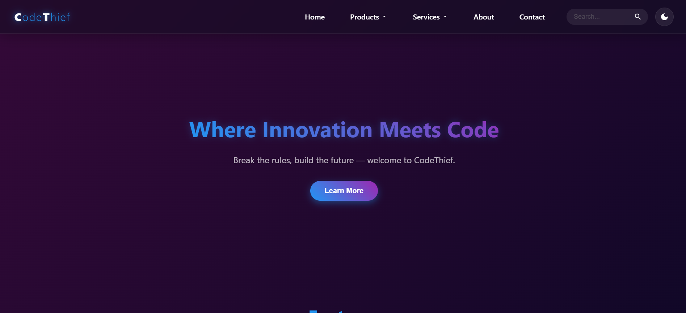

# 🚀 CodeThief

CodeThief is a futuristic, visually captivating website built with HTML, CSS, and JavaScript. It features modern animations, interactive components, theme switching, and responsive design. Explore a sleek UI with seamless navigation, search functionality, and dynamic dropdowns — all crafted with attention to detail and user experience.

🌐 **Live Demo**: [ --> Click Here ](https://rishabhmunakhiya.github.io/)

---

## ✨ Features

- 🌗 **Dark/Light Theme Toggle** – Easily switch between day and night modes.
- 🔍 **Search Functionality** – Interactive search bar with sleek animations.
- 📂 **Animated Dropdown Menu** – Smooth transitions and hover effects.
- 📱 **Fully Responsive Design** – Looks great on all screen sizes.
- 🧭 **Working Navigation Links** – Navigate between pages with clickable nav links.
- 📝 **Footer with Feedback & Quick Links** – Includes social links and a feedback/comment section.
- 💻 **Modern UI/UX** – Clean, futuristic, and visually attractive design.

---

## 📷 Screenshots

> 


---

## 🛠️ Technologies Used

- **HTML5**
- **CSS3**
- **JavaScript (Vanilla)**
- **GitHub Pages** for deployment

---

## 📂 Folder Structure

```
RishabhMunakhiya.github.io/
│
├── index.html
├── about.html
├── contact.html
├── contact.css
├── style.css
├── script.js
├── favicon.png
└── README.md
```

---

## 🧠 How to Use

1. Visit the live site: [Live demo](https://rishabhmunakhiya.github.io/)
2. Click through the navigation to explore the different pages.
3. Try the theme switcher and other interactive elements.
4. Leave your feedback in the comment section in the footer!

---

## 💬 Feedback

Have ideas to improve the site? Found a bug?  
Feel free to open an issue or leave feedback in the footer section on the website!

---

## 📢 Connect With Me

- 💼 [LinkedIn](https://www.linkedin.com/in/rishabh-dtu27/)
- 🐙 [GitHub](https://github.com/rishabhmunakhiya)


---


## 🙏 Acknowledgements

- CodeThief was built with a focus on clean design, smooth interaction, and responsive layout. 

- It reflects my interest in futuristic UI and passion for frontend development.  

- Every section, animation, and effect was thoughtfully designed to offer a better user experience. 

- This project represents both my learning journey and creative expression through code.

---

## 👨‍💻 Author

Crafted with 💡 creativity, 🎨 design focus, and 💻 clean code by **Rishabh**